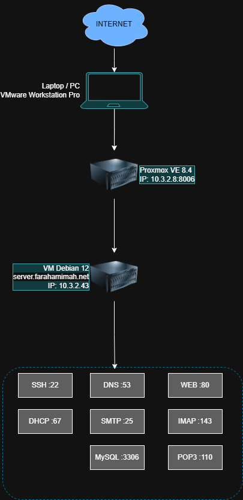

## 🚀 Auto Server Provisioning v1.0.0

Script otomatis instalasi & konfigurasi server Debian 12

### ✅ Fitur
- SSH Server Hardening
- DHCP Server (isc-dhcp-server)
- DNS Server (BIND9)
- Web Server (Apache2)
- Database Server (MariaDB + phpMyAdmin)
- Mail Server (Postfix + Dovecot)
- Report Generator (.txt & .html)

### 📋 Cara Penggunaan
```bash
git clone git@github.com:farah1120/auto-server-provisioning.git
cd auto-server-provisioning
bash install.sh
```

### 🖥️ Spesifikasi
- OS: Debian 12 (Bookworm)
- Platform: Proxmox VE 8.4
- Domain: server.farahamimah.net

## 🗺️ Topologi Jaringan

